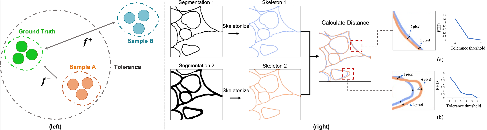
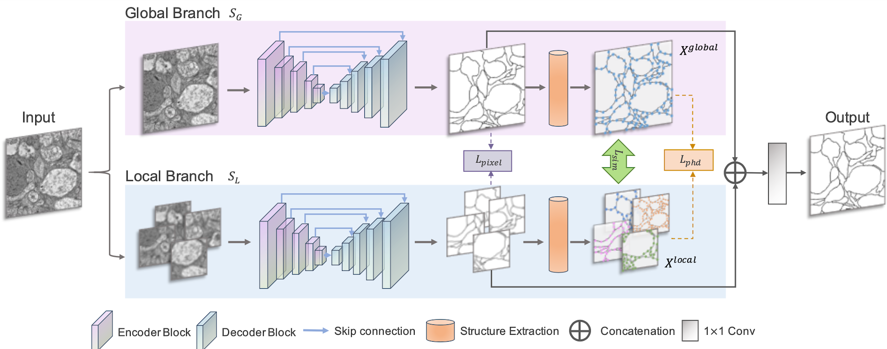

# PS-Net
---
We introduced a novel cell membrane segmentation framework including: 1) an unique evaluation criterion, the perceptual Hausdorff distance (PHD), which evaluates the dissimilarity of cell membrane structures with an adjustable tolerance; and 2) an end-to-end PHD-guided segmentation network (PS-Net), which includes a multiscale architecture and carefully constructed PHD loss functions that are adaptively tuned for coarse-to-fine training. Our analysis suggested that people would be more sensitive to the membrane's structure while tolerating misalignment. Furthermore, we discovered that the vision system analyzes images in a global-local and coarse-to-fine manner. The subjective experiment shows that PHD is more consistent with human perception than other evaluation criteria. Furthermore, the proposed PS-Net outperforms state-of-the-art (SOTA) methods on both low- and high-resolution EM image datasets, as well as on other natural image datasets.


<p align="center"></p>
<p align="center">Figure 1. Overview of the PHD criterion.</p>
<p align="center"></p>
<p align="center">Figure 2. Overview of the PS-Net.</p>

## Requirements

```
h5py
matplotlib
numpy
numpy-utils
argparse
torch
torchvision
scikit-image
pyimagej
sklearn
tensorboardX
opencv-python
numba
```

## Usage
1. Download PS-Net

	```bash
	https://github.com/EmmaSRH/PS-Net
	```
2. Download ISBI 2012 dataset and U-RISC dataset.
3. Please change the dataset paths in ```main.py```. 

	```bash
	python main.py
	```